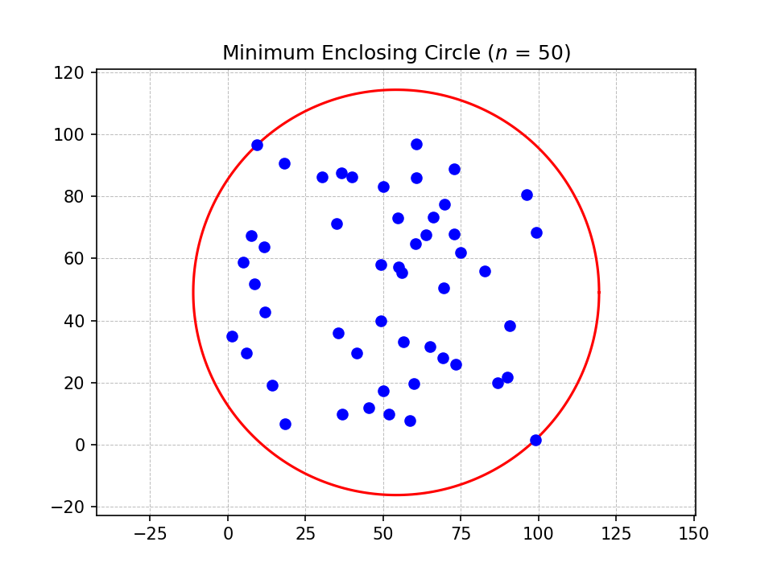

## Minimum Enclosing Circle
Given a set $P$ of $n$ points in the plane find a circle of minimum radius that contains $P$.

    

### Analysis
**Time and Space.** We can break it down by the following guiding questions:

**Q1:** How much space and time does `min_circle_with_2_points` take?  
**A1:** `min_circle_with_2_points` takes $O(j)$ time and space because `make_circle_with_3_points` runs in $O(1)$ time and we're just going through `P`. Note that the point set `P` passed in to this function is of length $j$ not $n$.

**Q2:** How much space and time does `min_circle_with_1_point` take?  
**A2:** `min_circle_with_1_point` takes $O(i)$ space. The time complexity is $O(i)$ + running time of all calls to `min_circle_with_2_points`. 

**Q3:** When we're running `min_circle_with_1_point`, what is the probability we call `min_circle_with_2_points`? 
**A3:** When we call `min_circle_with_1_point`, the probability we call `min_circle_with_2_points` at the
$j$-th step of the loop,  is $\frac{2}{j}$. The minimum enclosing circle of $P[1..j]$ with $p_i$ forced on the boundary is defined by $p_i$ plus at most $2$ other points from $P[1..j]$. By backwards analysis, we ask: what is the probability that $p_j$, the last point in our random permutation, is one of those two points that make us reconstruct our circle? Since the permutation is uniform, this is simply $\frac{2}{j}$.

**Q4:** So if there is a $\frac{2}{j}$ chance of calling `min_circle_with_2_points`, what's the expected running time of `min_circle_with_1_point`? 
**A4:**

$$
O(i) + \sum_{j=1}^{i} \frac{2}{j} \cdot O(j) = O(i)
$$

and $i \leq n$.

**Q5:** How much space and time does `min_circle` take?  
**A5:**  `min_circle` takes $O(n)$ space. The time complexity is $O(n)$ + running time of all calls to `min_circle_with_1_point`. 

**Q6:** When we're running `min_circle`, what is the probability we call `min_circle_with_1_point`? 
**A6:** Similar to **A3**, we do backwards analysis again. The minimum enclosing circle of $P[1..i]$ is defined by at most $3$ points from $P[1..i]$. By backwards analysis, the probability that $p_i$ is one of those (at most) $3$ boundary-defining points is $\frac{3}{i}$.

**Q7:** What's the running time and space of `min_circle`? 
**A7:** 

$$
O(n) + \sum_{i=1}^{n} \frac{3}{i} \cdot O(i) = O(n)
$$

So the total algorithm runs in $O(n)$ expected time and space.

